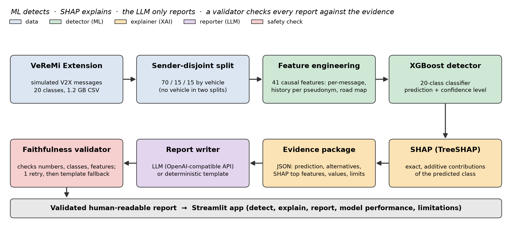
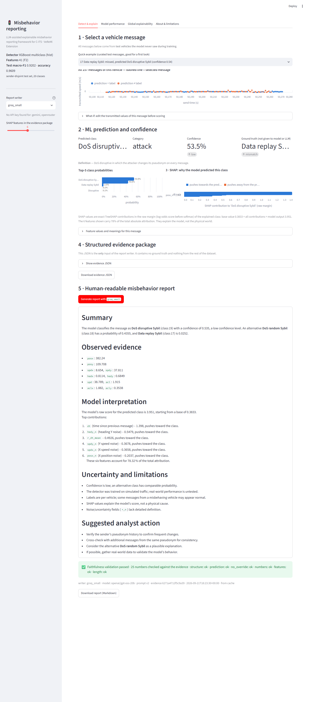

# LLM-Assisted Explainable Misbehavior Reporting Framework for C-ITS

An end-to-end, reproducible XAI pipeline for vehicular misbehavior detection on the [VeReMi Extension](https://zenodo.org/records/20090854) dataset. A machine-learning model detects the misbehavior, SHAP explains the decision, and a language model (or a template) turns the evidence into a human-readable report that is automatically checked against that evidence.

```
VeReMi messages → feature preparation → ML detector (XGBoost, 20 classes) → prediction + confidence
               → SHAP (exact TreeSHAP) → structured evidence package → report writer (LLM or template)
               → automatic faithfulness validation → human-readable report → Streamlit app
```



**Roles.** The ML model is the only detector. SHAP explains that model. The LLM only rewrites a small JSON evidence package into prose; it cannot change the prediction, and every number, class and feature it mentions is checked against the evidence. If no LLM is available (or its text fails validation twice) a deterministic template report is used.



## Headline results (measured on test vehicles never seen in training)

| Final detector (`xgb_F2_pseudo_d6`, 41 features) | value |
|---|---|
| Macro-F1 (20 classes) | **0.920** |
| Balanced accuracy | 0.901 |
| Accuracy | 0.961 |
| MCC | 0.937 |
| Binary F1 (misbehaving vs genuine, from the same predictions) | 0.977 |
| Vehicle-level macro-F1 (majority vote per vehicle) | 0.954 (0.957 in the bootstrap table: the tie-break of the vote differs for 3 of 3,710 vehicles) |
| Expected calibration error | 0.0014 |
| Latency: features + model + SHAP for one message | ≈ 0.10 s (CPU) |

| Finding | macro-F1 |
|---|---|
| Per-message features only (F0), vehicle-disjoint split | 0.369 |
| Same model and features, naive random row split (as in most papers) | 0.680 ← inflated by vehicle leakage |
| + causal history features per pseudonym (F1) | 0.908 |
| + road-map plausibility feature (F2) | 0.919 |
| F2 with history keyed on the simulator's true sender id instead of the pseudonym | 0.858 |
| F2, random row split | 0.954 ← inflated |

**Uncertainty.** With the test vehicles resampled within each class (95 % interval): macro-F1 0.920 [0.915, 0.926]; balanced accuracy 0.901 [0.894, 0.907]. The same configuration trained on three other vehicle splits gives macro-F1 0.9203 / 0.9189 / 0.9194 (mean over four splits 0.9197, std 0.0007). The confidence level printed in the reports is informative but not a guarantee: accuracy is 0.978 at the *high* level (92.9 % of the messages), 0.789 at *moderate* and 0.556 at *low*, yet 52 % of all errors still occur at *high* confidence (`outputs/results/confidence_level_validation.csv`).

**Explanations and reports.** SHAP is exactly additive with respect to the deployed model (max error 1.2e-5 on 3,000 test messages); replacing the top-3 SHAP features lowers the predicted-class probability by 0.74 on average, versus 0.08 for 3 random features. Report faithfulness was validated automatically on a stratified test sample of 60 reports (3 per class, including misclassified and low-confidence cases): template 200/200; LLM `openai/gpt-oss-20b` 60/60 (55 first try, 5 after one corrective retry, no fallbacks); `openai/gpt-oss-120b` 59/60 written by the LLM (55 first try, 4 after the retry; 1 fell back to the template because the draft named a feature that is not in the evidence). An offline number-to-feature binding check found 0 suspicious lines out of 1,068 (441 + 627). Completeness rules (top SHAP feature named, confidence level stated, runner-up class named when confidence is not high, simulated-data caveat) are met in 93–100 % of the reports depending on the rule and the model (`outputs/results/report_quality_summary.csv`). These are automatic checks of faithfulness and completeness; clarity and usefulness have **not** been rated by humans yet (a blind rating sheet is in `outputs/human_rating/`).

All tables are in `outputs/results/` (paper-style tables in `outputs/results/paper_tables/`), figures in `outputs/figures/`.

## Quick start

Developed and tested on Windows with Python 3.12.

```powershell
git clone <repository-url>
cd <repository-folder>
python -m venv .venv
.venv\Scripts\Activate.ps1
pip install -r requirements.txt
streamlit run app/streamlit_app.py
```

The app runs out of the box: the trained model, the road map and a test-only demo subset are in `models/`; the dataset is not needed.

### Tests

```powershell
python tests/test_reporting.py
python tests/test_pipeline_and_app.py
python tests/test_data_and_evidence.py
python tests/test_features.py
```

No network or API key is needed. The split test in `test_data_and_evidence.py` and all of `test_features.py` need the files that `scripts/01_prepare_data.py` creates from the dataset; without them they are reported as `SKIPPED`.

### Enable LLM-written reports (optional; a free tier is enough)

1. Copy `.env.example` to `.env` and paste **one** key (for example a free Groq key from console.groq.com).
2. Restart the app: the writer appears in the sidebar. The provider and model are one line each in `config.yaml → llm.profiles` (any OpenAI-compatible endpoint works, including a local Ollama server); no code change is needed.
3. Check the writer with one report: `python scripts/check_llm.py groq_small`. If the provider has renamed its models, look up the current name in its console and edit `model:` in the profile.
4. Evaluate faithfulness on the stratified sample: `python scripts/05_evaluate_reports.py groq_small 3` (60 reports; respects free-tier limits and caches the results), then `python scripts/06_binding_check.py groq_small`.

## Reproduce everything from the raw CSV

Put `mixalldata_clean.csv` into `data/` (where to get it and how to check it: [data/README.md](data/README.md)), then run from the project root:

| Step | Command | Output |
|---|---|---|
| 1 | `python scripts/01_prepare_data.py` | Parquet copy, **vehicle-level split**, feature tables (`artifacts/`) |
| 1b | `python scripts/01b_road_feature.py` | road map from genuine training traffic, `road_dist` feature |
| 2 | `python scripts/02_train_models.py` | all experiments → `outputs/results/experiments/*.json` (≈ 1.5 h, GPU optional) |
| 3 | `python scripts/03_finalize_and_explain.py xgb_F2_pseudo_d6` | frozen model + model card + demo data in `models/`, SHAP files, sanity checks |
| 4 | `python scripts/04_make_figures.py` | result figures and summary tables |
| 5 | `python scripts/05_evaluate_reports.py template 10` | reports + faithfulness evaluation (`outputs/reports/`) |
| 6 | `python scripts/06_binding_check.py groq_small` | offline check that numbers in LLM reports are attached to the right feature |
| 7 | `python scripts/07_uncertainty_and_errors.py` | bootstrap CIs (vehicles resampled), paired comparisons, calibration, confidence-level validation, selective prediction, error-cause checks (≈ 4 min) |
| 8 | `python scripts/08_seed_robustness.py 1 2 3` | final configuration retrained on other vehicle splits (≈ 5 min per seed) |
| 9 | `python scripts/09_paper_tables.py` | tables T0–T11 (CSV + Markdown) in `outputs/results/paper_tables/`, `class_signatures.png` |
| 10 | `python scripts/10_showcase.py groq_small` | curated example messages for the app, their SHAP figures, cached reports |
| 11 | `python scripts/11_report_quality.py` | completeness rules on the stored reports (no LLM judge) |
| 12 | `python scripts/12_app_screenshots.py` | app screenshots in `outputs/figures/app/` (optional: needs `playwright` and Edge/Chrome) |
| 13 | `python scripts/13_architecture_diagram.py` | `outputs/figures/architecture.png` |
| 14 | `python scripts/14_human_rating.py make` / `summarize <sheet>` | blind, paired rating sheet (LLM vs template) and its summary |

`scripts/dataset_audit.py` and `scripts/class_mapping_verification.py` reproduce the dataset audit and the class-mapping evidence. `VeReMi_XAI_Framework.ipynb` (Part 1) covers data understanding, quality and exploratory analysis; `VeReMi_XAI_Part2.ipynb` (Part 2) is the executed walk-through of the vehicle-level structure, features, models, uncertainty, SHAP, reports, validator and app (it reads the saved results and runs two small live experiments; a few minutes).

## Repository layout

```
config.yaml                 paths, seed, class mapping + definitions, LLM profiles   (single source of truth)
src/veremi_xai/             data, features, models, evaluate, explain, evidence, pipeline, viz
src/veremi_xai/reporting/   prompts, template writer, OpenAI-compatible writer, validator, cache + fallback logic
scripts/                    numbered, re-runnable pipeline steps
app/streamlit_app.py        presentation layer (imports the package; contains no modelling logic)
models/                     deployable artifacts: final_model.ubj, model_card.json, road_cells.npy, demo_messages.parquet, showcase_messages.json
outputs/                    figures, result tables, experiment JSONs, generated reports, rating sheet
tests/                      reporting, feature-causality, data/evidence, pipeline and headless app tests
docs/                       background.md, architecture_decisions.md, research_log.md, repository_guide.md, running_guide.md
data/                       place of the dataset (not included; see data/README.md)
artifacts/                  large intermediate files (git-ignored; created by the scripts)
```

## Documentation

- [docs/background.md](docs/background.md): objective, verified dataset facts, class-mapping evidence, methodology, literature review
- [docs/architecture_decisions.md](docs/architecture_decisions.md): 18 design decisions, each with its measured evidence
- [docs/research_log.md](docs/research_log.md): dated log of what was measured
- [docs/repository_guide.md](docs/repository_guide.md): what every file does, and a guide to the two notebooks
- [docs/running_guide.md](docs/running_guide.md): step-by-step run and check guide

## Important notes

- **Class mapping** follows the F2MD simulator enum and was verified against the data; the table in Khan et al. (2025) is inconsistent with this CSV (see [docs/background.md](docs/background.md) §4).
- **Known ceilings** (not bugs): labels are per vehicle, so genuine-looking messages of attackers count as errors (Eventual stop before the stop, the attacker's own beacons in Grid Sybil, Delayed messages after the warm-up); replay attacks copy genuine messages bit-for-bit; Data replay Sybil and DoS disruptive Sybil are hard to separate from receiver-observable information (F1 0.63 / 0.82).
- The data is simulated (F2MD/LuST); nothing here has been validated on real traffic.

## Authors

Vineet Yadav (2025MSBDA023) and Yash Verma (2025MSBDA030) — batchmates, joint internship project.

## Data, licence and citation

- The **code and documentation** are released under the MIT licence ([LICENSE](LICENSE)).
- The **data** is the VeReMi Extension dataset (CC BY 4.0). `models/demo_messages.parquet` is a small subset of its messages; the full dataset is not included. Details and the required attribution: [NOTICE.md](NOTICE.md).

If you use the data, please cite:

> J. Kamel, M. Wolf, R. W. van der Heijden, A. Kaiser, P. Urien and F. Kargl, "VeReMi Extension: A Dataset for Comparable Evaluation of Misbehavior Detection in VANETs," in *Proc. IEEE International Conference on Communications (ICC)*, 2020.
